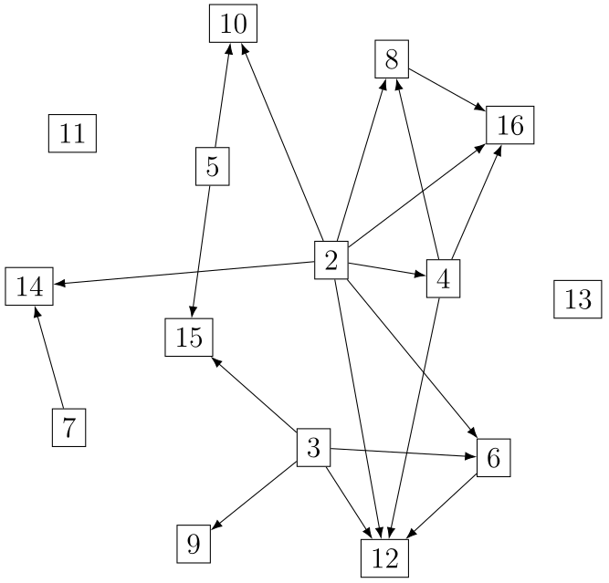

# Graph2LaTeX

Manipulates graphs. The goal is to convert an 'abstract' graph given as an input, and to create a readable planar representation, using the LaTeX/Tikz format.
A gradient descent method is used: the connected vertices are attracted to one another, while trying to repulse the others.

An example: there is an arrow between _n_ and _m_ iff _n_ divides _m_

